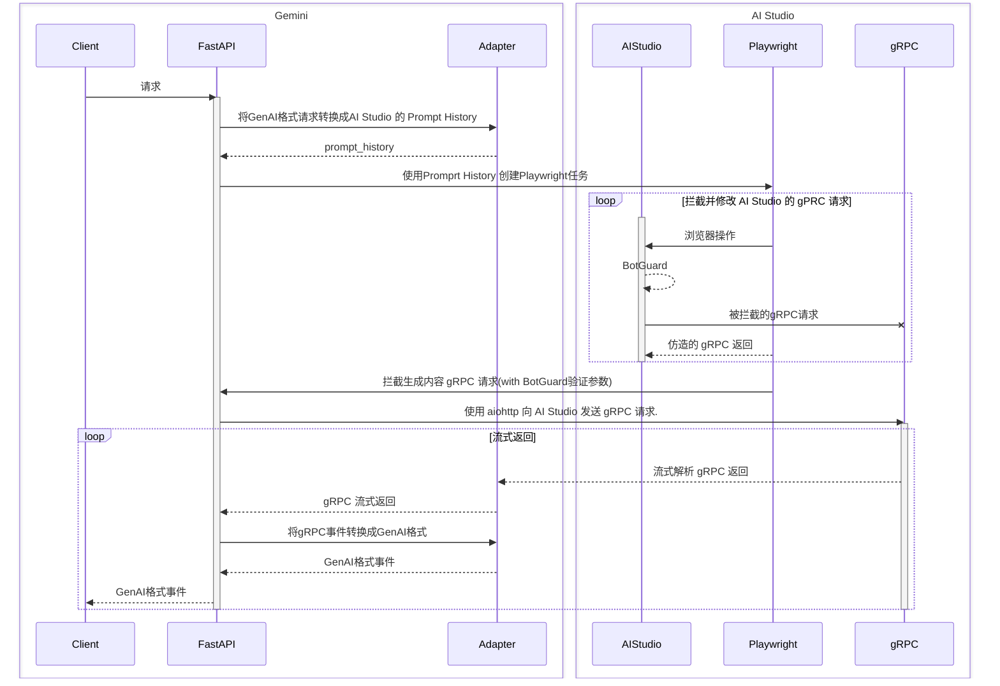

HAGMI is a AI-Studio to Gemini Mimicking Interface

---

这是一个将AI Studio转换为Gemini API的项目


### Warning

项目目前处于概念验证阶段，缺乏详细文档，请勿就使用方法提交issue。

### 使用方法

#### 1. 设置配置文件

```shell
cp config.yaml.example config.yaml
```

根据需求修改配置文件

#### 2. 配置有效登录状态

* 在config.yaml中配置有效的登录凭证，将自动使用登录凭证进行登录。（不支持2FA）
* 也可以在states文件夹中存放 playwright 的 Storage State 文件。

#### 3a. 直接启动项目（调试）

```shell
uv run python app.py
```

#### 3b. 或使用 Docker/Podman compose（推荐）
```shell
docker-compose build
docker-compose up -d
```

#### 使用GenAI API格式访问服务

```shell
curl "http://localhost:8000/v1beta/models/gemini-2.5-pro:streamGenerateContent" \
  -H "x-goog-api-key: YOUR_API_KEY" \
  -H 'Content-Type: application/json' \
  -X POST \
  -d '{
    "contents": [
      {
        "parts": [
          {
            "text": "Hi."
          }
        ]
      },
      {
        "role": "model",
        "parts": [
          {
            "text": "<think>"
          }
        ]
      }
    ],
    "generationConfig": {
      "thinkingConfig": {
        "thinkingBudget": 0
      }
    }
  }'
```

### 项目架构

#### 实现原理




### Roadmap

#### 最小可用版本（1.0.0）

- [x] 概念验证
- [x] 多模态输入输出
- [x] 生成参数配置
- [x] Function Calling
- [ ] Structured Output
- [ ] Gounding
- [ ] Url Context
- [ ] Code Execution

#### 后续改进

- [ ] AI Studio代理配置
- [ ] 预构建Docker镜像
- [ ] 详细配置文档
- [ ] 注入隐藏模型
- [ ] 添加OpenAI API支持
- [ ] 将 context <250k 的请求 offload 到 GenAI API


### Disclaimer

通过本项目使用AI Studio可能违反Google的服务条款，请自行承担风险。
