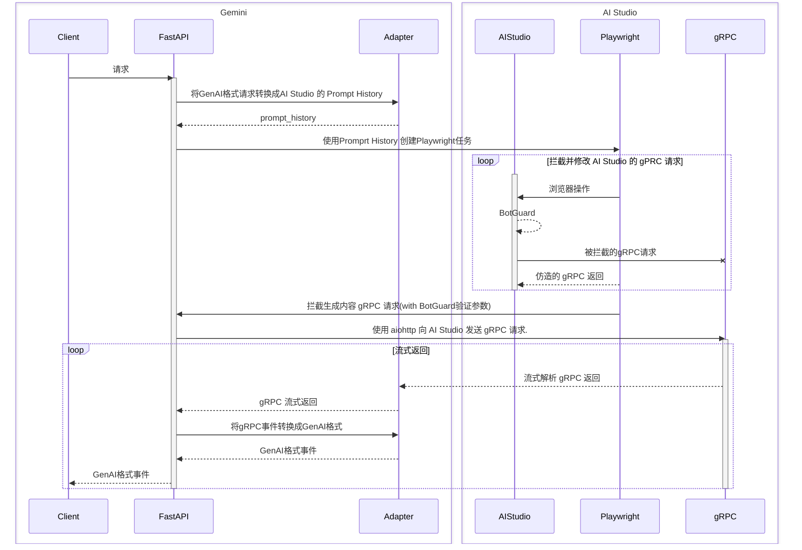

HAGMI is a AI-Studio to Gemini Mimicking Interface

---

这是一个将AI Studio转换为Gemini API的项目


### 使用方法

#### 1. 设置配置文件

```shell
cp config.yaml.example config.yaml
```

配置文件中已包含各配置项说明。

#### 2. 配置有效登录状态

##### 方法1: 在config.yaml中配置有效的登录凭证

在服务启动时将尝试使用 `config.yaml` 中配置的登录凭证恢复登录状态，若未登录或登录状态已过期，将尝试使用帐号密码进行登录。
注：目前无法处理ReCaptcha或者2FA，如果无法使用自动登录，请选择方法2。

##### 方法2: 保存登录状态文件

可以使用 `scripts/create_state.py` 脚本进行登录保存登录状态文件。脚本接受的参数如下
```
usage: create_state.py [-h] [--email user@example.com] [--password PASSWORD] [--remote http://127.0.0.1:8000]

登录AI Studio 并保存登录状态

options:
  -h, --help            show this help message and exit
  --email user@example.com
                        Google 帐号自动填充 (default: None)
  --password PASSWORD   Google 帐号密码自动填充(可选) (default: None)
  --remote http://127.0.0.1:8000
                        推送到远程HAGMI实例 (default: None)
```

若脚本提供了 `email` 与/或 `password`参数，脚本将尝试自动填充帐号密码进行登录，并由用户处理可能的额外验证(ReCaptcha或者2FA)。
如果 `email` 和 `password`参数未提供，则由用户完成整个登录流程。
在登录完成后，脚本将尝试从 AI Studio 获取帐号信息，若脚本未能获取帐号信息，将提示用户输入帐号名称，最后把保存登录状态至`states/{email}.json`。


如果提供了 `remote` 参数，脚本将尝试推送登录状态文件到远程 HAGMI 实例。


#### 3a. 直接启动项目（调试）

项目使用 `uv` 作为包管理， 安装方法参考 [uv的安装文档](https://docs.astral.sh/uv/getting-started/installation/)

在第一次启动之前需要通过命令安装camoufox和playwright依赖

```shell
uv run playwright install firefox --with-deps
uv run camoufox fetch
```

安装完依赖后，后续可以通过命令直接启动项目

```shell
uv run python app.py
```

#### 3b. 或使用 Docker/Podman compose（推荐）
```shell
docker-compose build
docker-compose up -d
```

#### 4. 使用GenAI API格式访问服务

```shell
curl "http://localhost:8000/v1beta/models/gemini-2.5-pro:streamGenerateContent" \
  -H "x-goog-api-key: YOUR_API_KEY" \
  -H 'Content-Type: application/json' \
  -X POST \
  -d '{
    "contents": [
      {
        "parts": [
          {
            "text": "Hi."
          }
        ]
      },
      {
        "role": "model",
        "parts": [
          {
            "text": "<think>"
          }
        ]
      }
    ],
    "generationConfig": {
      "thinkingConfig": {
        "thinkingBudget": 0
      }
    }
  }'
```

### 项目架构

#### 实现原理




### Roadmap

#### 最小可用版本（1.0.0）

- [x] 概念验证
- [x] 多模态输入输出
- [x] 生成参数配置
- [x] Function Calling
- [x] Structured Output
- [x] Gounding
- [x] Url Context
- [x] Code Execution

#### 后续改进

- [x] AI Studio代理配置
- [x] 预构建Docker镜像
- [x] 详细配置文档
- [ ] 注入隐藏模型
- [ ] 添加OpenAI API支持
- [ ] 将 context <200k 的请求 offload 到 GenAI API


#### 待计划

- [ ] Imagen 系列模型支持
- [ ] TTS 系列模型支持
- [ ] Gemini Flash Live 系列模型支持
- [ ] Gemini Flash Native Audio 系列模型支持
- [ ] Veo 系列模型支持


### Disclaimer

通过本项目使用AI Studio可能违反Google的服务条款，请自行承担风险。
